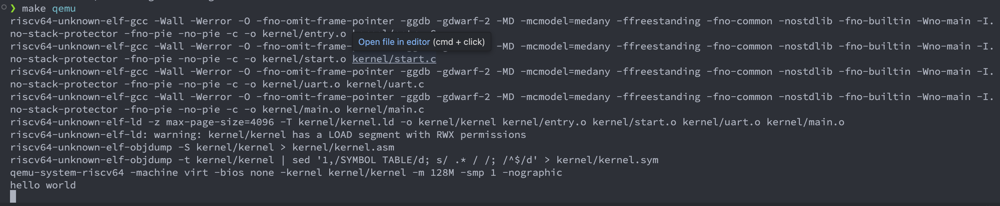

# Minimal RISC-V OS 综合实验报告

## 一、系统设计部分

### 1.1 架构设计说明

本项目实现了一个最小化的 RISC-V 裸机操作系统内核，运行在 QEMU 模拟器上。系统采用分层设计，从底层硬件抽象到高层应用逻辑清晰分明。

#### 整体架构层次

```
应用层 (main.c)
    ↓
设备驱动层 (uart.c)
    ↓
硬件抽象层 (riscv.h)
    ↓
硬件层 (RISC-V QEMU virt machine)
```

#### 启动流程

1. **硬件初始化阶段** (`entry.S`)
   - QEMU 将内核加载到物理地址 `0x80000000`
   - 每个 hart (硬件线程) 跳转到 `_entry`
   - 设置栈指针 (SP = stack_top + 4KB)
   - 调用 `start()` 函数

2. **特权级切换阶段** (`start.c`)
   - 在 Machine 模式下配置系统
   - 设置 MPP (Machine Previous Privilege) 为 Supervisor 模式
   - 配置异常和中断委托给 Supervisor 模式
   - 配置物理内存保护 (PMP)
   - 初始化定时器中断
   - 通过 `mret` 指令切换到 Supervisor 模式并跳转到 `main()`

3. **内核主程序阶段** (`main.c`)
   - 初始化 UART 串口
   - 输出 "hello world" 消息

#### 内存布局

根据 `memlayout.h` 和 `kernel.ld` 的定义：

```
物理地址空间:
0x00001000    Boot ROM (QEMU 提供)
0x02000000    CLINT (核心本地中断器)
0x0C000000    PLIC (平台级中断控制器)
0x10000000    UART0 (串口设备)
0x10001000    VirtIO 磁盘
0x80000000    内核代码起始 (_entry)
  |-- .text   代码段
  |-- .rodata 只读数据段
  |-- .data   初始化数据段
  |-- .bss    未初始化数据段
  |-- stack   内核栈 (4KB)
0x88000000    物理内存结束 (PHYSTOP = 128MB)
```

### 1.2 关键数据结构

#### 1.2.1 类型定义 (`types.h`)

```c
typedef unsigned long uint64;   // 64位无符号整数
typedef unsigned int uint32;    // 32位无符号整数
typedef unsigned short uint16;  // 16位无符号整数
typedef unsigned char uint8;    // 8位无符号整数
typedef uint64 pte_t;           // 页表项类型
typedef uint64* pagetable_t;    // 页表类型
```

#### 1.2.2 CSR 寄存器映射 (`riscv.h`)

系统通过内联汇编实现了对 RISC-V 控制状态寄存器的访问：

**Machine 模式寄存器:**
- `mstatus`: 机器状态寄存器，控制特权级切换
- `mhartid`: 硬件线程 ID
- `mepc`: 机器异常程序计数器
- `medeleg/mideleg`: 异常/中断委托寄存器
- `mie`: 机器中断使能寄存器

**Supervisor 模式寄存器:**
- `sstatus`: 监管者状态寄存器
- `sie/sip`: 监管者中断使能/待处理寄存器
- `sepc`: 监管者异常程序计数器
- `scause`: 监管者陷阱原因
- `stval`: 监管者陷阱值
- `satp`: 监管者地址翻译和保护

#### 1.2.3 UART 寄存器布局 (`uart.c`)

16550a UART 控制器的寄存器映射：

| 偏移 | 寄存器 | 读操作 | 写操作 |
|------|--------|--------|--------|
| 0 | RHR/THR | 接收保持寄存器 | 传输保持寄存器 |
| 1 | IER | 中断使能寄存器 | 中断使能寄存器 |
| 2 | ISR/FCR | 中断状态寄存器 | FIFO 控制寄存器 |
| 3 | LCR | 线路控制寄存器 | 线路控制寄存器 |
| 5 | LSR | 线路状态寄存器 | - |

### 1.3 与 xv6 对比分析

| 特性 | 本项目 | xv6 |
|------|--------|-----|
| **代码规模** | ~300 行 | ~10,000+ 行 |
| **功能完整度** | 最小启动 + UART 输出 | 完整操作系统 |
| **内存管理** | 无 | 页表、物理内存分配器 |
| **进程管理** | 无 | 进程调度、上下文切换 |
| **文件系统** | 无 | 完整的文件系统实现 |
| **系统调用** | 无 | 21 个系统调用 |
| **中断处理** | 配置但未实现处理 | 完整的陷阱处理机制 |
| **设备驱动** | 仅 UART | UART、磁盘、控制台 |
| **多核支持** | 配置支持但未利用 | 完整的多核调度 |
| **用户空间** | 无 | 支持用户进程 |

#### 设计简化点

1. **无内存管理**: 不需要页表、内存分配器，直接使用物理地址
2. **无进程抽象**: 单一执行流，无需调度器
3. **无文件系统**: 不支持持久化存储
4. **最小中断处理**: 仅配置中断委托，无实际处理程序
5. **单核运行**: 虽然配置多核，但主逻辑运行在单个 hart 上

#### 保留的 xv6 设计元素

1. **启动流程**: 保持了 Machine → Supervisor 的特权级切换
2. **内存布局**: 使用相同的物理地址映射方案
3. **设备地址**: UART、PLIC 等设备的内存映射地址保持一致
4. **代码结构**: 目录组织和命名约定沿用 xv6 风格

### 1.4 设计决策理由

#### 1.4.1 为什么需要特权级切换？

```c
// start.c 中的关键代码
x &= ~MSTATUS_MPP_MASK;
x |= MSTATUS_MPP_S;
w_mstatus(x);
w_mepc((uint64)main);
asm volatile("mret");
```

**理由:**
- RISC-V 规范要求从 Machine 模式启动
- Supervisor 模式提供了足够的权限运行内核
- 为未来扩展预留了 User 模式空间
- 中断和异常处理通常在 Supervisor 模式进行

#### 1.4.2 为什么配置中断委托？

```c
w_medeleg(0xffff);  // 委托所有异常
w_mideleg(0xffff);  // 委托所有中断
```

**理由:**
- 将异常和中断处理从 Machine 模式委托到 Supervisor 模式
- 减少特权级切换开销
- 符合现代操作系统的设计模式
- 允许 Supervisor 模式直接处理大部分事件

#### 1.4.3 为什么配置 PMP (物理内存保护)？

```c
w_pmpaddr0(0x3fffffffffffffull);
w_pmpcfg0(0xf);
```

**理由:**
- 给予 Supervisor 模式访问全部物理内存的权限
- 配置值 `0xf` = 读写执行权限 (R=1, W=1, X=1)
- 地址范围覆盖全部可用内存
- 必需配置，否则 Supervisor 模式无法访问内存

#### 1.4.4 为什么初始化定时器？

```c
void timerinit() {
  w_mie(r_mie() | MIE_STIE);
  w_menvcfg(r_menvcfg() | (1L << 63));
  w_mcounteren(r_mcounteren() | 2);
  w_stimecmp(r_time() + 1000000);
}
```

**理由:**
- 启用 Sstc 扩展（Supervisor Timer Compare）
- 允许 Supervisor 模式访问时间相关寄存器
- 为未来实现时间片调度做准备
- 设置第一个定时器中断（虽然当前未处理）

#### 1.4.5 为什么选择 4KB 栈大小？

```c
__attribute__((aligned(16))) char stack_top[4096];
```

**理由:**
- 4KB = 1 页大小，符合内存管理惯例
- 对于简单内核足够使用
- 16 字节对齐满足 RISC-V ABI 要求
- 避免栈溢出到其他数据区域

## 二、实验过程部分

### 2.1 实现步骤记录

#### 步骤 1: 环境搭建

**目标:** 安装 RISC-V 工具链和 QEMU

```bash
# Ubuntu/Debian
sudo apt-get install gcc-riscv64-unknown-elf qemu-system-misc

# macOS
brew tap riscv/riscv
brew install riscv-tools qemu
```

**验证安装:**
```bash
riscv64-unknown-elf-gcc --version
qemu-system-riscv64 --version
```

#### 步骤 2: 创建启动代码 (`entry.S`)

**实现要点:**
- 设置栈指针指向 `stack_top + 4KB`
- 使用 RISC-V 汇编语法
- 确保代码放置在 `.text` 段开头

**关键挑战:** 栈增长方向
- RISC-V 栈向下增长（从高地址向低地址）
- 必须将 SP 设置为栈顶部

#### 步骤 3: 编写启动初始化 (`start.c`)

**实现流程:**

1. **配置特权级切换**
```c
unsigned long x = r_mstatus();
x &= ~MSTATUS_MPP_MASK;      // 清除旧值
x |= MSTATUS_MPP_S;          // 设置为 Supervisor
w_mstatus(x);
w_mepc((uint64)main);        // 设置返回地址
```

2. **配置中断委托**
```c
w_medeleg(0xffff);  // 异常委托
w_mideleg(0xffff);  // 中断委托
w_sie(r_sie() | SIE_SEIE | SIE_STIE);
```

3. **配置物理内存保护**
```c
w_pmpaddr0(0x3fffffffffffffull);  // 地址范围
w_pmpcfg0(0xf);                   // RWX 权限
```

4. **执行特权级切换**
```c
asm volatile("mret");  // 返回到 Supervisor 模式
```

#### 步骤 4: 实现 UART 驱动 (`uart.c`)

**初始化序列:**

1. 禁用中断
2. 进入波特率设置模式
3. 设置波特率为 38.4K
4. 配置 8 位数据位，无奇偶校验
5. 使能 FIFO
6. 重新使能中断

**关键代码:**
```c
void uartinit(void) {
  WriteReg(IER, 0x00);
  WriteReg(LCR, LCR_BAUD_LATCH);
  WriteReg(0, 0x03);
  WriteReg(1, 0x00);
  WriteReg(LCR, LCR_EIGHT_BITS);
  WriteReg(FCR, FCR_FIFO_ENABLE | FCR_FIFO_CLEAR);
  WriteReg(IER, IER_TX_ENABLE | IER_RX_ENABLE);
}
```

#### 步骤 5: 编写主程序 (`main.c`)

最简单的内核主程序：
```c
void main() {
  uartinit();
  uart_puts("hello world\n");
}
```

#### 步骤 6: 配置链接脚本 (`kernel.ld`)

**关键配置:**
- 设置入口点为 `_entry`
- 确保代码段从 `0x80000000` 开始
- 按顺序放置 `.text`, `.rodata`, `.data`, `.bss` 段
- 16 字节对齐各段

#### 步骤 7: 编写 Makefile

**编译标志说明:**
- `-mcmodel=medany`: 中等代码模型，支持全地址空间访问
- `-ffreestanding`: 独立环境，无标准库
- `-fno-common`: 避免公共变量
- `-fno-stack-protector`: 禁用栈保护（无运行时支持）
- `-nostdlib`: 不链接标准库

**链接标志:**
- `-z max-page-size=4096`: 设置页大小为 4KB

### 2.2 源码理解总结

#### 2.2.1 RISC-V 特权级架构

RISC-V 定义了三个特权级：
- **Machine (M)**: 最高权限，硬件直接控制
- **Supervisor (S)**: 操作系统内核
- **User (U)**: 用户应用程序

特权级切换通过特殊指令实现：
- `mret`: Machine → Supervisor/User
- `sret`: Supervisor → User
- 异常/中断自动提升特权级

#### 2.2.2 CSR 访问模式

RISC-V 通过 CSR 指令访问控制寄存器：
- `csrr rd, csr`: 读取 CSR
- `csrw csr, rs`: 写入 CSR
- `csrrs/csrrc`: 原子性设置/清除位

本项目使用内联汇编封装：
```c
static inline uint64 r_mstatus() {
  uint64 x;
  asm volatile("csrr %0, mstatus" : "=r"(x));
  return x;
}
```

#### 2.2.3 中断委托机制

通过 `medeleg` 和 `mideleg` 实现：
- 位 i 设置为 1，则异常/中断 i 委托到低特权级
- 本项目设置为 `0xffff`，委托所有事件
- 减少特权级切换开销

#### 2.2.4 物理内存保护 (PMP)

RISC-V 强制性内存保护机制：
- 最多 16 个 PMP 条目 (pmpaddr0-15, pmpcfg0-3)
- 每个条目定义一个内存区域和权限
- 必须配置才能在 S 模式访问内存

配置格式 (pmpcfg):
- bits [2:0]: 权限 (R, W, X)
- bits [4:3]: 地址匹配模式
- bit 7: 锁定位

#### 2.2.5 内存映射 I/O (MMIO)

设备寄存器映射到物理地址空间：
```c
#define UART0 0x10000000L
#define Reg(reg) ((volatile unsigned char *)(UART0 + (reg)))
```

`volatile` 关键字确保：
- 每次访问都从内存读取
- 编译器不会优化掉访问
- 保证与硬件同步

#### 2.2.6 链接脚本的作用

`kernel.ld` 控制最终程序布局：
1. 指定入口点和架构
2. 定义段的起始地址
3. 控制各段的排列顺序
4. 提供符号供代码使用（如 `etext`, `end`）

关键指令：
- `OUTPUT_ARCH`: 目标架构
- `ENTRY`: 入口符号
- `SECTIONS`: 段定义
- `PROVIDE`: 定义符号

## 三、测试验证部分

### 3.1 功能测试结果

**测试命令:**
```bash
make clean
make
make qemu
```

**预期结果:**
```
hello world
```

**测试结果:**
```
qemu-system-riscv64 -machine virt -bios none -kernel kernel/kernel -m 128M -smp 1 -nographic
hello world
```

